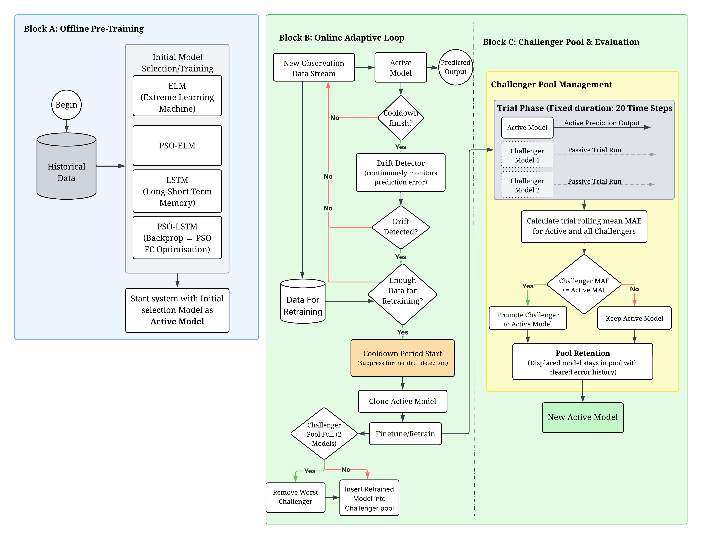

# Drift-Resilient Time Series Forecasting

**Author:** Wai Lee Boo (2625170)  
**Supervisor:** Professor Leandro Minku  
**Institution:** University of Birmingham  

---

## Overview

This project proposes **Trial-Based Drift-Triggered Retraining (TDTR)**, a lightweight framework for drift-adaptive time series forecasting. TDTR monitors prediction error using statistical drift detectors and retrains a challenger model only when drift is detected, adopting it only if it outperforms the current active model over a fixed evaluation horizon. This avoids the computational overhead of ensemble methods while remaining responsive to genuine distributional change.

The framework is evaluated across six model types (LSTM, ELM, PSO-LSTM, PSO-ELM, Random Forest, and SVR) on four controlled synthetic drift benchmarks (linear/non-linear × abrupt/gradual) and real S&P 500 data. An ablation study compares TDTR against fixed-interval retraining without a drift detector, and a limited-training experiment tests performance under genuinely unseen concept configurations.

Key results: TDTR reduces Price MAE by 41% for LSTM and 31% for PSO-LSTM on real financial data. ELM-based models show no benefit due to strong static generalisation. On synthetic recurring benchmarks, PSO-ELM performs best overall. Fixed-interval retraining matches TDTR in accuracy but at roughly double the computational cost. Under genuinely unseen concepts, TDTR produces gains of up to 70%.

The research is guided by the following questions:

- **RQ1:** To what extent does PSO-based optimisation of output layer weights improve the robustness of neural forecasting models (ELM and LSTM) under different types of concept drift?
- **RQ2:** How effectively does TDTR improve forecasting performance compared to non-adaptive baselines across synthetic drift scenarios and real financial data?
- **RQ3:** How does continuous online retraining without a drift detector compare to TDTR under identical retraining windows and computational constraints?
- **RQ4:** Can conventional machine learning methods (Random Forest and SVR) benefit from drift adaptation within TDTR, and do they exhibit the same ceiling effect as analytical neural models?
- **RQ5:** Does TDTR improve forecasting performance over non-adaptive baselines when models are trained on limited concept coverage and evaluated on unseen concept configurations?

---

## Project Structure


```
FINALYEARPROJECT/
├── frontend/                             # Frontend to present during inspection
├── backend/
│   ├── data/
│   │   ├── diagram/                      # Generated plots and figures
│   │   ├── raw/                          # Downloaded stock price CSVs (GSPC)
│   │   ├── results/                      # Experiment result CSVs
│   │   └── synthetic/                    # Generated synthetic drift datasets
│   │       ├── linear_abrupt_drift/
│   │       ├── linear_gradual_drift/
│   │       ├── nonlinear_abrupt_drift/
│   │       └── nonlinear_gradual_drift/
│   └── src/
│       ├── data_utils/
│       │   ├── data_loader.py            # Load and split data
│       │   ├── fetch_data.py             # Download stock data via yfinance
│       │   ├── preprocess.py             # Feature engineering and scaling
│       │   ├── synthetic_generator.py    # Synthetic drift dataset generator
│       │   └── windowing.py              # Sliding window creation
│       ├── detectors/
│       │   └── drift_detector.py         # ADWIN, Page-Hinkley, KSWIN wrappers
│       ├── eda/
│       │   ├── price_plots.py            # Price and return visualisations
│       │   └── synthetic_plots.py        # Synthetic drift visualisations
│       ├── models/
│       │   ├── baselines/
│       │   │   ├── arima_base.py         # Baseline ARIMA
│       │   │   ├── elm_base.py           # Baseline ELM
│       │   │   ├── lstm_base.py          # Baseline LSTM
│       │   │   ├── rf_base.py            # Baseline Random Forest
│       │   │   └── svr_base.py           # Baseline SVR
│       │   ├── optimisers/
│       │   │   └── PSO.py                # Particle Swarm Optimisation core
│       │   ├── PSO_ELM.py                # PSO-optimised ELM
│       │   └── PSO_LSTM.py               # PSO-optimised LSTM
│       ├── training/
│       │   ├── online_eval.py            # Online evaluation loop (RQ2, Phase 1 & 2, RQ3, RQ4,RQ5)
│       │   ├── train_basearima.py        # Train baseline ARIMA (RQ1)
│       │   ├── train_baseelm.py          # Train baseline ELM (RQ1, RQ5)
│       │   ├── train_baselstm.py         # Train baseline LSTM (RQ1, RQ5)
│       │   ├── train_baseRF.py           # Train baseline Random Forest (RQ4)
│       │   ├── train_basesvr.py          # Train baseline SVR (RQ4)
│       │   ├── train_drift_real.py       # RQ2 — adaptive experiments on real data (RQ2)
│       │   ├── train_drift_synthetic.py  # RQ2 — detector comparison on synthetic data (RQ2)
│       │   ├── train_psoelm.py           # Train PSO-ELM (RQ1, RQ5)
│       │   ├── train_psolstm.py          # Train PSO-LSTM (RQ1, RQ5)
│       │   ├── train_rq4.py              # RQ4 experiments (RQ4)
│       │   ├── train_utils.py            # Shared training helpers
│       │   └── tune_lstm.py              # Optuna hyperparameter tuning
│       └── utils/
│           ├── config.py                 # Feature columns and ticker settings
│           ├── evaluation.py             # Evaluation metrics
│           ├── paths.py                  # Data and results directory paths
│           ├── results_logger.py         # Results logging
│           └── statistical_tests.py     # Statistical tests
├── docs/
│   └── Final_Year_Project_report.pdf
├── .gitignore
├── environment.yml
├── requirements.txt
└── README.md
```

---

## Setup

### View Frontend

The frontend is hosted and can be viewed at: [www.wailee.boo](https://www.wailee.boo)

### Requirements

- Python 3.10+
- Key packages: `torch`, `scikit-learn`, `river`, `yfinance`, `optuna`, `numpy`, `pandas`, `matplotlib`, `scipy`, `statsmodels`

### Install dependencies

Using conda (recommended):

```bash
conda env create -f environment.yml
conda activate fyp
```

Or using pip:

```bash
pip install -r requirements.txt
```

### Fetch stock data

Download the S&P 500 daily price series via yfinance:

```bash
python backend/src/data_utils/fetch_data.py
```

Data is saved to `backend/data/raw/`.

### Generate synthetic datasets

```bash
python backend/src/data_utils/synthetic_generator.py
```

Generates 30 series per drift type (120 total) into `backend/data/synthetic/`.

---

## Synthetic Drift Types

Four drift scenarios are generated with known concept boundaries:

| Type | Description |
|---|---|
| `linear_abrupt` | Linear regime changes instantly at the drift point |
| `linear_gradual` | Linear slope changes gradually over a transition window |
| `nonlinear_abrupt` | Nonlinear regime changes abruptly |
| `nonlinear_gradual` | Nonlinear regime changes gradually |

Each drift scenario is generated **30 times**, with different initial starting points and independently sampled noise added to each series.

Each time series consists of **10,000 time steps** across **10 concepts** of **2,000 steps each**. A drift occurs at the end of each concept segment, creating clearly defined and controlled concept boundaries. From the sixth concept onwards, earlier concepts recur, making the benchmark recurring rather than entirely novel throughout.

---

## Adaptive Framework Design



The online evaluation loop [`online_eval.py`](./backend/src/training/online_eval.py) implements a **trial-based model selection** strategy:

1. A drift detector continuously monitors the prediction error stream. When drift is detected, the current active model is copied and retrained using a recent sliding window of data.
2. The retrained model is introduced into a challenger pool and runs silently alongside the active model for a fixed trial period of 20 steps. The challenger pool maintains a maximum of two candidate models at any time.
3. After the trial phase, the model achieving the lower mean absolute error (abs(MAE)) over the trial window is promoted to become the active model.
4. The displaced model is retained in the challenger pool with its error history cleared, allowing recovery if the data distribution reverts to a prior regime.
5. If the challenger pool is full when a new retrained model is generated:
    - The challenger with the highest trial MAE (the worst performing model) is removed.
    - The new challenger is inserted into the pool
    - This ensures bounded memory usage while preserving stronger historical candidates.
6. A cooldown period suppresses further drift detection after each trial to prevent cascading false alarms.

Notes: This is distinct from ensemble learning as only one model makes predictions at any time. Challenger models are evaluated passively and do not influence live outputs.

---

## Running Experiments

All training commands below must be run from the `backend/` directory:

```bash
cd backend
```

### RQ1 - Static Baselines

Train and evaluate all models (ARIMA, LSTM, ELM, PSO-LSTM, PSO-ELM) on real financial data and all four synthetic drift types without any drift adaptation:

```bash
python -m src.training.train_basearima
python -m src.training.train_baselstm
python -m src.training.train_baseelm
python -m src.training.train_psoelm
python -m src.training.train_psolstm
```

Results saved to `backend/data/results/rq1_results.csv`.

### RQ2 - TDTR Drift-Adaptive Comparison

**Phase 1** — Compare drift detectors (ADWIN, Page-Hinkley, KSWIN) using PSO-LSTM on synthetic data:

```bash
python -m src.training.train_drift_synthetic
```

**Phase 2** — Evaluate TDTR across all four neural models (LSTM, ELM, PSO-LSTM, PSO-ELM) using KSWIN on synthetic and real data:

```bash
python -m src.training.train_drift_real
```

Results saved to `backend/data/results/rq2_phase1_results.csv`, `backend/data/results/rq2_phase2_synthetic_results.csv`, and `backend/data/results/rq2_phase2_real_results.csv`.

### RQ3 - Continuous Retraining Ablation

Evaluate fixed-interval retraining (no drift detector) against TDTR under identical computational budgets. In `train_drift_synthetic.py` and `train_drift_real.py`, comment out the `rq2` function call in `main()` and uncomment the `rq3` function call, then run:

```bash
python -m src.training.train_drift_synthetic
python -m src.training.train_drift_real
```

Results saved to `backend/data/results/rq3_synthetic_results.csv` and `backend/data/results/rq3_real_results.csv`.

### RQ4 - Conventional ML Models

Evaluate Random Forest and SVR — static baselines and TDTR-adaptive — using the same configuration as RQ2:

```bash
python -m src.training.train_baseRF
python -m src.training.train_basesvr
python -m src.training.train_rq4
```

Results saved to `backend/data/results/rq4_baseline_results.csv`, `backend/data/results/rq4_synthetic_results.csv`, and `backend/data/results/rq4_real_results.csv`.

### RQ5 - Limited Training Coverage

Evaluate TDTR when models are trained on only the first two concepts (20% of the series) and tested on unseen concept configurations. Set `train_ratio=0.1` in the training scripts, then run the same scripts as RQ1 (for static baselines) and RQ2 (for adaptive models):

```bash
python -m src.training.train_baselstm   # static baselines
python -m src.training.train_baseelm
python -m src.training.train_psolstm
python -m src.training.train_psoelm
python -m src.training.train_drift_synthetic  # adaptive
python -m src.training.train_drift_real
```

Results saved to `backend/data/results/rq5_synthetic_results.csv` and `backend/data/results/rq5_baseline_results.csv`.

---

## Key Configuration

Edit `backend/src/utils/config.py` to change feature columns or tickers.
Edit `backend/src/utils/paths.py` to change data and results directories.

---

## Documents

[📄 Final Report](./docs/Final_Year_Project_report.pdf)